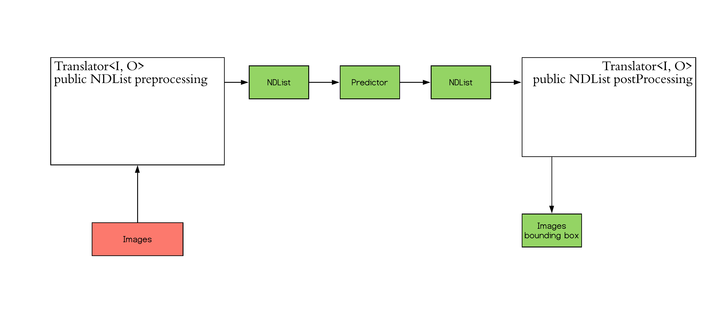

# Build your first Inference Application

## Introduction
Welcome to the Joule world.
Joule is an API designed to deal with all kinds of Deep Learning tasks.
Users will be able to create, train and do inference with Deep Learning models.

In this tutorial, we will guide you to create your first application to use Joule for Deep Learning Inference.
We will implement an Object Detection Application based on pre-trained Resnet50SSD model.

## Prerequisite
Before we start, please see the JavaDoc of the following classes.
These are the core component we are using to load the pre-trained model and do inference.

- [Model](https://joule.s3.amazonaws.com/java-api/software/amazon/ai/Model.html)
- [Predictor](https://joule.s3.amazonaws.com/java-api/software/amazon/ai/inference/Predictor.html)
- [Translator](https://joule.s3.amazonaws.com/java-api/software/amazon/ai/Translator.html)
- [NDArray](https://joule.s3.amazonaws.com/java-api/software/amazon/ai/ndarray/NDArray.html) and [NDList](https://joule.s3.amazonaws.com/java-api/software/amazon/ai/ndarray/NDList.html)

## Start Implementation
The workflow looks like the following:

Here are the steps to finish this task:

- Write preprocessing function to prepare the image
- Write postprocessing function to get the output as the image
- Load the model
- Create predictor
- Run inference!

### Step 1 Preprocess

You can make start by implementing the Translator class explained above. 
The input that Predict going to take is an NDList which is a list of NDArrays.
NDArray is the image that should be translated to.

The input of the translator should be an buffered image or any other type that can load an image.

The SSD Example will take an image as a NCHW format:
- N: Batch size
- C: Channel
- H: Height
- W: Width

To simplify our inference experience, the batch size will be 1. Channel is usually 3 (RGB).
For Height and Width, we recommend to use (512, 512) since the model was trained on images input.

