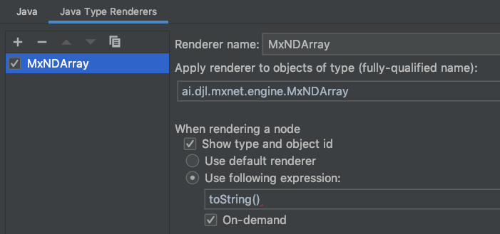

# Development Guideline

## Introduction

Thank you for your interest in contributing to the Deep Java Library (DJL).
In this document, we will cover everything you need to build, test, and debug your code when developing DJL.

Many of us use the [IntelliJ IDEA IDE](https://www.jetbrains.com/idea/) to develop DJL and we will sometimes mention it. However, there is no requirement to use this IDE.

## Coding Conventions

When writing code for DJL, we usually try to follow standard Java coding conventions. In addition, here are some other conventions we use:

- For builders, use setXXX for required values and optXXX for optional ones
- Follow the example in `Convolution` and `Conv2d` when making extendable builders
- The usage of `final` for members and parameters is generally discouraged in favor of readability.  

Alongside these conventions, we have a number of checks that are run including PMD, SpotBugs, and Checkstyle. These can all be verified by running the gradle `build` target. Instructions for fixing any problems will be given by the relevant tool.

We also follow the [AOSP Java Code Style](https://source.android.com/setup/contribute/code-style). See [here](https://github.com/google/google-java-format) for plugins that can help setup your IDE to use this style. The formatting is checked very strictly. Failing the formatting check will look like:

```
> Task :api:verifyJava FAILED

FAILURE: Build failed with an exception.

* Where:
Script '/Volumes/Unix/projects/Joule/tools/gradle/formatter.gradle' line: 57

* What went wrong:
Execution failed for task ':api:verifyJava'.
> File not formatted: /Volumes/Unix/projects/Joule/api/src/main/java/ai/djl/nn/convolutional/Conv2d.java
  See https://github.com/deepjavalibrary/djl/blob/master/docs/development/development_guideline.md#coding-conventions for formatting instructions
```

If you do fail the format check, the easiest way to resolve it is to run the gradle `formatJava` target to reformat your code. It may be helpful to just run the formatter before you build the project rather than waiting for the formatting verification to fail.

## Commit message conventions

We don't have rule to enforce git commit message format. However, we encourage developers and reviewers to follow
the good practice:

- Limit the subject line to 72 characters
- Separate subject from body with a blank line
- Adding a prefix if possible, for example `[api]` or `docs:`
- Do not end the subject line with a period
- Wrap the body line if possible
- Make subject line more specific, avoid using some like: **Updated document**
    

## Documentation Conventions

DJL should have good and clear documentation for the sake of users learning about it and about deep learning.

The most basic element of our documentation is the javadoc. Javadoc is required in most classes and methods by checkstyle. We try to follow the javadoc standards for the most part. The javadoc should begin with a sentence ending in period. Then, there should be an empty line and then optionally some additional paragraphs of description that each are prefixed with `<p>` and separated by newlines. Then, there should be the parameters, return values, and other attributes which do not end in a period.

### Deep Learning Concepts

DJL documentation will also coincide with various deep learning concepts that users may or may not be familiar with. Some of these include the various operations and blocks, activation functions, loss functions, optimizers, datasets, and models.

For all of the topics that are associated with a particular method or class (and can be defined in that javadoc), you should try to include the following information:

- 1-3 sentence summary of what the topic is (note that other terms in the summary should link to their respective definitions) assuming that users don't have familiarity with the topic
- A link to the paper indicated with an anchor tag with the text "paper", possibly some additional anchor tags to other sources that help explain it
- 1-3 sentence summary of historical context(when it was created and why).
- 1-3 sentence guidance of why or why not to use it (pros and cons, is it still commonly used today)
- A latex formula (if appropriate) should go after the above information and before any other miscellaneous information and the attributes

The goal is not to explain everything. It is to explain just enough that a user who sees it has a high level understanding of what it is and how to act on the information.

For larger topics which do not have a corresponding javadoc section, they should link to an outside source that helps explain it. If possible, that source should be the d2l-java book.

## Build

This project uses a gradle wrapper, so you don't have to install gradle on your machine. You can just call the gradle wrapper using the following command:

```
./gradlew
```

There are several gradle build targets you can use. The following are the most common targets:

- `formatJava` or `fJ`: clean up and reformat your Java code
- `build`: build the whole project and run all tests
- `javadoc`: build the javadoc only
- `jar`: build the project only

You can also run this from a subfolder to build for only the module within that folder.

Run the following command to list all available tasks:

```sh
./gradlew tasks --all
```

## Test

Sometimes you may need to run individual tests or examples.
If you are developing with an IDE, you can run a test by selecting the test and clicking the "Run" button.

From the command line, you can run the following command to run a test:

```
./gradlew :<module>:run -Dmain=<class_name> --args ""
```

For example, if you would like to run the complete integration test, you can use the following command:

```
./gradlew :integration:run -Dmain=ai.djl.integration.IntegrationTest
```

To run an individual integration test from the command line, use the following: 

```
./gradlew :integration:run --args="-c <class_name> -m <method_name>"
```

## Logging

To get a better understanding of your problems when developing, you can enable logging by adding the following parameter to your test command:

```
-Dai.djl.logging.level=debug
```

The values to set the log level to can be found [here](https://logging.apache.org/log4j/2.x/manual/customloglevels.html).

## Run examples in IntelliJ
Before you run any examples in IntelliJ, configure your Application template as follows:

1. Navigate to IntelliJ menu and select "Run". Select "Edit configurations...".
2. Expand "Template" on the left side list, and select "Application".
3. Change the "Working directory:" value to: "$MODULE_WORKING_DIR$".
4. Select "OK" to save the template.

Navigate to the 'examples' module. Open the class that you want to execute (e.g. ai.djl.examples.inference.ObjectDetection).
Select the triangle at the class declaration line. A popup menu appears with 3 items:

- Run 'ObjectDetection.main()'
- Debug 'ObjectDetection.main()'
- Run 'ObjectDetection.main()' with coverage

Select "Run 'ObjectDetection.main()'". IntelliJ executes the ObjectDetection example.

If you manually create a run configuration or the existing configuration failed to execute
due to a missing example resource, you can edit the configuration. Change the "Working directory:"
value to: $MODULE_WORKING_DIR$ to fix the issue.

## Debug

When debugging a DJL application in IntelliJ, it is often helpful to inspect your NDArray variables. Because NDArrays may contain
a large number of elements, rendering them can be resource-heavy and cause the debugger to hang.

IntelliJ allows you to [customize the data view in the Debug Tools](https://www.jetbrains.com/help/idea/customizing-views.html#customize-data-view).
You can create your own NDArray renderer as follows:


Please make sure to:

- Check the "On-demand" option, which causes IntelliJ to only render the NDArray when you click on the variable.
- Change the "Use following expression" field to something like [toDebugString(100, 10, 10, 20)](https://javadoc.io/static/ai.djl/api/0.12.0/ai/djl/ndarray/NDArray.html#toDebugString-int-int-int-int-)
if you want to adjust the range of NDArray's debug output.

## Common Problems

Please follow the [Troubleshooting](troubleshooting.md) guide for common problems and their solutions.
