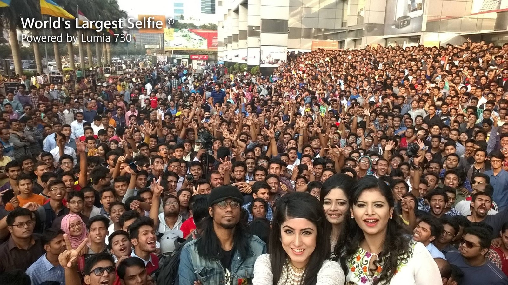
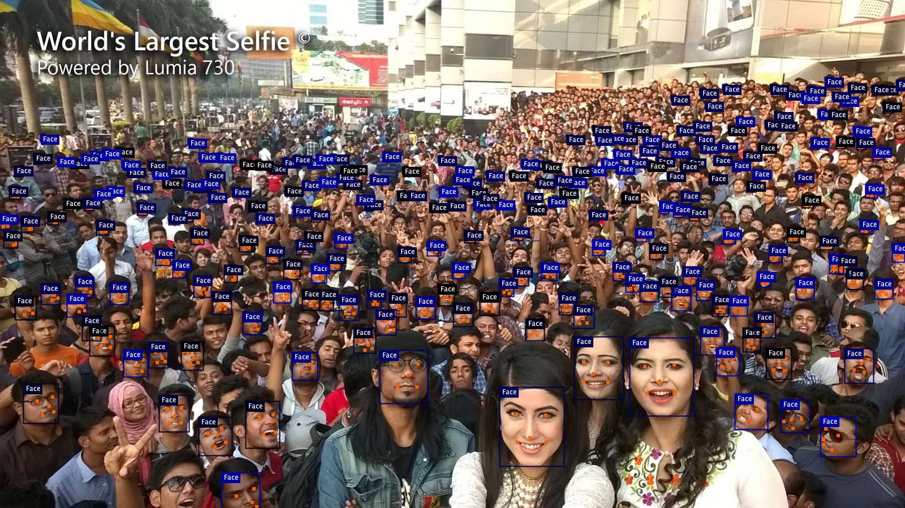

# Face detection example

In this example, you learn how to implement inference code with a pytorch model to detect faces in an image.

Server model:
The source code can be found at [RetinaFaceDetection.java](https://github.com/deepjavalibrary/djl/blob/master/examples/src/main/java/ai/djl/examples/inference/face/RetinaFaceDetection.java).  
The model github can be found at [Pytorch_Retinaface](https://github.com/biubug6/Pytorch_Retinaface).

Lightweight model:
The source code can be found at [LightFaceDetection.java](https://github.com/deepjavalibrary/djl/blob/master/examples/src/main/java/ai/djl/examples/inference/face/LightFaceDetection.java).  
The model github can be found at [Ultra-Light-Fast-Generic-Face-Detector-1MB](https://github.com/Linzaer/Ultra-Light-Fast-Generic-Face-Detector-1MB).

## Setup guide

To configure your development environment, follow [setup](../../docs/development/setup.md).

## Run face detection example

### Input image file
You can find the image used in this example in the project test resource folder: `src/test/resources/largest_selfie.jpg`



### Build the project and run
Use the following command to run the project:

```sh
cd examples
./gradlew run -Dmain=ai.djl.examples.inference.face.RetinaFaceDetection
./gradlew run -Dmain=ai.djl.examples.inference.face.LightFaceDetection
```

Your output should look like the following:

```text
[INFO ] - Face detection result image has been saved in: build/output/retinaface_detected.png
[INFO ] - [
	{"class": "Face", "probability": 0.99993, "bounds": {"x"=0.552, "y"=0.762, "width"=0.071, "height"=0.156}}
	{"class": "Face", "probability": 0.99992, "bounds": {"x"=0.696, "y"=0.665, "width"=0.071, "height"=0.155}}
	{"class": "Face", "probability": 0.99976, "bounds": {"x"=0.176, "y"=0.778, "width"=0.033, "height"=0.073}}
	{"class": "Face", "probability": 0.99961, "bounds": {"x"=0.934, "y"=0.686, "width"=0.032, "height"=0.068}}
	{"class": "Face", "probability": 0.99949, "bounds": {"x"=0.026, "y"=0.756, "width"=0.039, "height"=0.078}}
]
```

An output image with bounding box will be saved as build/output/retinaface_detected.png:  
(For lightweight model, should be ultranet_detected.png)

