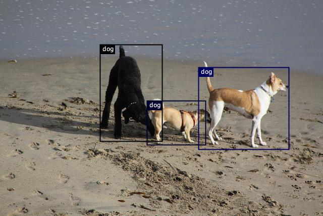

# Object detection using a model zoo model

[Object detection](https://en.wikipedia.org/wiki/Object_detection) is a computer vision technique
for locating instances of objects in images or videos.

In this example, we will show you how to implement inference code with a [ModelZoo model](../../docs/model-zoo.md) to detect dogs in an image.

The source code can be found at [ObjectDetection.java](https://github.com/awslabs/djl/blob/master/examples/src/main/java/ai/djl/examples/inference/ObjectDetection.java).

You can also find the jupyter notebook tutorial [here](../../jupyter/README.md#run-object-detection-with-model-zoo).
The jupyter notebook explains the key concepts in detail.

## Setup Guide

Follow [setup](../../docs/development/setup.md) to configure your development environment.

## Run object detection example

### Input image file
You can find the image used in this example in the project test resource folder: `src/test/resources/3dogs.jpg`


### Build the project and run
Use the following command to run the project:
```
cd examples
./gradlew run -Dmain=ai.djl.examples.inference.ObjectDetection
```

Your output should look like the following:
```text
[INFO ] - Detected objects image has been saved in: build/output/ssd.png
[INFO ] - [
        class: "dog", probability: 0.99839, bounds: [x=0.615, y=0.312, width=0.281, height=0.381]
        class: "dog", probability: 0.98797, bounds: [x=0.455, y=0.468, width=0.183, height=0.205]
        class: "dog", probability: 0.66150, bounds: [x=0.310, y=0.207, width=0.193, height=0.448]
]
```

An output image with bounding box will be saved as build/output/ssd.jpg:


