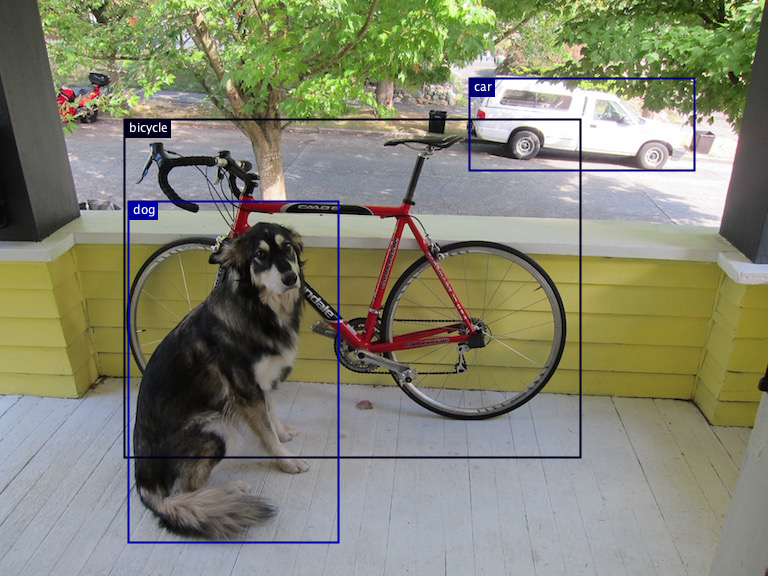

# Object detection using a model zoo model

[Object detection](https://en.wikipedia.org/wiki/Object_detection) is a computer vision technique
for locating instances of objects in images or videos.

In this example, you learn how to implement inference code with a [ModelZoo model](../../docs/model-zoo.md) to detect dogs in an image.

The source code can be found at [ObjectDetection.java](https://github.com/deepjavalibrary/djl/blob/master/examples/src/main/java/ai/djl/examples/inference/ObjectDetection.java).

You can also use the [Jupyter notebook tutorial](../../jupyter/object_detection_with_model_zoo.ipynb).
The Jupyter notebook explains the key concepts in detail.

## Setup guide

To configure your development environment, follow [setup](../../docs/development/setup.md).

## Run object detection example

### Input image file
You can find the image used in this example in the project test resource folder: `src/test/resources/dog_bike_car.jpg`


### Build the project and run
Use the following command to run the project:

```
cd examples
./gradlew run -Dmain=ai.djl.examples.inference.ObjectDetection
```

Your output should look like the following:

```text
[INFO ] - Detected objects image has been saved in: build/output/detected-dog_bike_car.png
[INFO ] - [
	{"class": "car", "probability": 0.99991, "bounds": {"x"=0.611, "y"=0.137, "width"=0.293, "height"=0.160}}
	{"class": "bicycle", "probability": 0.95385, "bounds": {"x"=0.162, "y"=0.207, "width"=0.594, "height"=0.588}}
	{"class": "dog", "probability": 0.93752, "bounds": {"x"=0.168, "y"=0.350, "width"=0.274, "height"=0.593}}
]
```

An output image with bounding box will be saved as build/output/detected-dog_bike_car.png:



## Run object detection example with other engines
For objection detection application, other than the default model zoo with the default engine,
we can also run it with other engines and model zoo. Here, we demonstrate with a pre-trained *YOLOV5s ONNX* model.

The model can be easily loaded with the following criteria

```java
Criteria<Image, DetectedObjects> criteria =
        Criteria.builder()
                .optApplication(Application.CV.OBJECT_DETECTION)
                .setTypes(Image.class, DetectedObjects.class)
                .optEngine("OnnxRuntime")
                .optProgress(new ProgressBar())
                .build();
```

where the `optFilter` is removed and `optEngine` is specified. The rest would be the same. 
