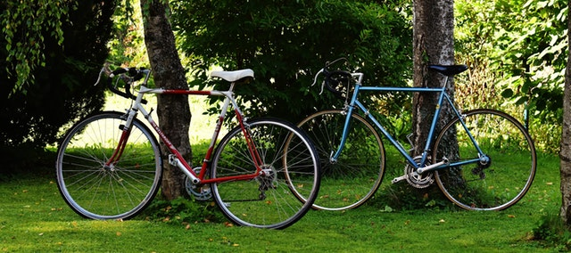

# Semantic segmentation example

Semantic segmentation refers to the task of detecting objects of various classes at pixel level. It colors the pixels based on the objects detected in that space.

In this example, you learn how to implement inference code with Deep Java Library (DJL) to segment classes at instance level in an image.

The following is the semantic segmentation example source code:

[SemanticSegmentation.java](https://github.com/deepjavalibrary/djl/blob/master/examples/src/main/java/ai/djl/examples/inference/SemanticSegmentation.java).


## Setup guide

Follow [setup](../../docs/development/setup.md) to configure your development environment.

## Run semantic segmentation example

### Input image file
You can find the image used in this example in project test resource folder: `src/test/resources/segmentation.jpg`



### Build the project and run

```sh
cd examples
./gradlew run -Dmain=ai.djl.examples.inference.SemanticSegmentation
```

This should produce the following output

```text
[INFO ] - Segmentation result image has been saved in: build/output/semantic_instances.png
```


With the previous command, an output image with bounding box around all objects will be saved at: build/output/semantic_instances.png:


## Run another semantic segmentation example

### Input image file
You can find the image used in this example in project test resource folder: `src/test/resources/dog_bike_car.jpg`


### Edit project to run inference with new image

In the `SemanticSegmentation.java` file, find the `predict()` method. Change the `imageFile` path to look like this:

```jav
Path imageFile = Paths.get("src/test/resources/dog_bike_car.jpg");
```

### Build the project and run

```sh
cd examples
./gradlew run -Dmain=ai.djl.examples.inference.InstanceSegmentation
```

This should produce the following output

```text
[INFO ] - Segmentation result image has been saved in: build/output/semantic_instances.png
```


With the previous command, an output image with bounding box around all objects will be saved at: build/output/semantic_instances.png:


