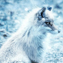

# Image Enhancement with ESRGAN using TensorFlow

[Generative Adversarial Networks](https://en.wikipedia.org/wiki/Generative_adversarial_network) (GANs) are a branch of deep learning used for generative modeling. 
They consist of 2 neural networks that act as adversaries, the Generator and the Discriminator. The Generator is assigned to generate fake images that look real, and the Discriminator needs to correctly identify the fake ones.

In this example, you will learn how to use a [ESRGAN](https://esrgan.readthedocs.io/en/latest/) generator to upscale images x4 better than any upscaling algorithm like bicubic or bilinear, using the [generator](https://tfhub.dev/captain-pool/esrgan-tf2/1) available on TensorFlow Hub. ESRGAN is short for Enhanced Super-Resolution Generative Adversarial Networks.

The source code for this example can be found in the [examples/sr](https://github.com/deepjavalibrary/djl/blob/master/examples/src/main/java/ai/djl/examples/inference/sr/) package.

## Setup guide

To configure your development environment, follow [setup](../../docs/development/setup.md).

## Run Generation

### Introduction 

ESRAGN is trained on the [DIV2K dataset](https://data.vision.ee.ethz.ch/cvl/DIV2K/). The model is very simple to interact with, the input is a batch of images and so is the output.

Thus, the input to the translator will be a list of images like so:

```java
List<Image> input = Arrays.asList(
     ImageFactory.getInstance().fromFile(Paths.get("src/test/resources/fox.png"))
);
```

### Build the project and run
Use the following commands to run the project:

```bash
cd examples
./gradlew run -Dmain=ai.djl.examples.inference.sr.SuperResolution
```

### Output

Here is an example, we compare the original image to the traditional Bicubic upscaling algorithm 

Original                 |  Bicubic          |  Super Resolution 
:-------------------------:|:-------------------------: |:-------------------------:
 |  | 
