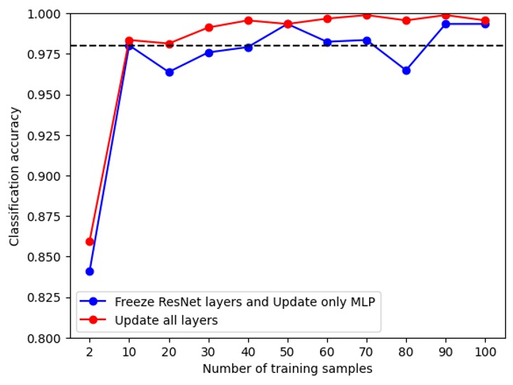
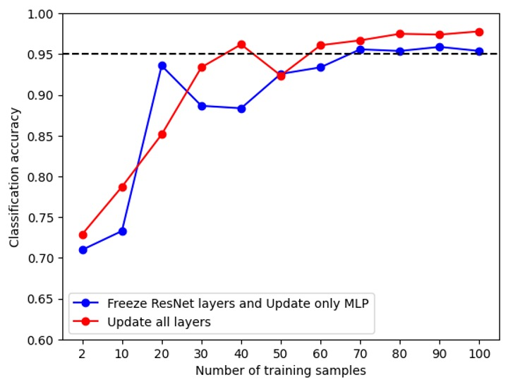

# The transfer learning package in DeepJavaLibrary (DJL)

Transfer learning is a popular technique that focuses on storing knowledge gained in solving one problem and applying it to a different but related problem. This is usually implemented by using a large pre-trained model to get an embedding vector, which can be thought of as a representation of the data, and then fed into the subsequent models. Thus, through transfer learing, users can benifit from the large pre-trained model and solve their own customized problem. A direct benifit is that the required training data size is significantly reduced with transfer learning, which helps to save the expensive data annotation cost.

Transfer learning has a broad variaty of applications, including general game playing, text classification, medical imaging, spam filtering, and many more. In this blogpost, we will demonstrate the transfer learnig tool package with an image classification task, a generic task in computer vision. We will also introduce two frameworks: Deep Java Library (DJL) and ATLearn.

[DJL](https://github.com/deepjavalibrary/djl) is a deep learning framework designed for Java developers. It is compatible with the existing popular deep learning engines, like PyTorch, MXNet, and Tensorflow, and enables users to easily train and deploy deep learning models in their Java application. So the transfer learning package introduced here make it possible for the Java developers to directly benifit from the large models pre-trained in python.

[ATLearn](https://github.com/awslabs/atlearn) is a small transfer learning toolkit for python users. It provides various APIs, transfer learning algorithms and model zoo to enable easy building of models for various customized tasks. Here, for DJL transfer learning package, the ATLearn is mainly used to modify an large pretrained model (e.g. remove the last neural network layer) and export a traced model file, which will be loaded in DJL.

A by-product of this transfer learning feature is that the model retraining, which allows model to improve and be fine-tuned with new data. This will be mentioned in the following.

The blogpost is structured as follows.
1. The the data set and the model
2. The demonstration in Java
3. Experiment on the reduction of the training data size
   Here, we demenstrate the transfer learning feature in PyTorch. But the feature on MXNet engine is also available.

## The data set and the model
In this blogpost, we demonstrate with the [fruit fresh/rotten dataset ](https://www.kaggle.com/datasets/sriramr/fruits-fresh-and-rotten-for-classification) and formulate it as a 2-class classification task. This demenstration can also be easily applied to other similar tasks and data, like [mask wearing detection](https://www.kaggle.com/datasets/andrewmvd/face-mask-detection?select=images) and [fruit freshness regression](https://www.kaggle.com/datasets/dcsyanwq/fuit-freshness). See examples in [ATLearn](https://github.com/awslabs/atlearn) for their implementation in python, as well as other examples of object detection.

The source model used in this demonestration is ResNet18 provided by PyTorch. This model is proven effective in classifying image data, e.g. ImageNet dataset. Here in the transfer learning task, we will remove its last layer, and use the rest to generate an embedding vector. Thus the power of the representation ability of ResNet18 is utilized.

On top of the embedding model, we further add a fully connected (FC) layer, the output dimension of which is the number of classes, i.e. 2 in this task. Also, during training, we will asign different learning rates on these two layers: the learning rate of the embedding layer is 10 times smaller than that of the FC layer. Thus, the pretrained parameters in the embedding layer is not changed too much.

## The demonstration in Java
Overall, this transfer learning feature is a training feature, so its API shares similarities to other DJL training examples. It mainly contains model structure, data loading, training configuration and metric.

### Setup
To get started with DJL transfer learning feature, add the following code snippet to the `build.gradle` file, which defines the necessary dependencies.
```bash
plugins {
  id 'java'
}
repositories {                           
  mavenCentral()
}
dependencies {
  implementation "org.apache.logging.log4j:log4j-slf4j-impl:2.17.1"
  implementation platform("ai.djl:bom:0.20.0")
  implementation "ai.djl:api"
  runtimeOnly "ai.djl.pytorch:pytorch-engine"
  runtimeOnly "ai.djl.pytorch:pytorch-model-zoo"
}
```

### Model building

**Get the embedding layer.** The embedding layer used here is obtained from ATLearn (or PyTorch). A pretrained model, e.g. ResNet18, is first editted in Python where the last layer is removed, and then is traced and exported as a torchscript file. This file is then directly loaded in DJL. This process can be done manually with a python script or with [ATLearn](https://github.com/awslabs/atlearn). It provides several transfer learning examples, where you can export the corresponding embedding layer.

```python
import ATLearn
model = ATLearn.get_embedding(ATLearn.task.IMAGE_CLASSIFICATION,
                              "EXPORT_PATH",
                              network='resnet18',  # pre-trained model from torch
                              user_network=None)   # users' own pre-trained model

```
After this, `resnet18_embedding.pt` will be generated in the `EXPORT_PATH`.

**Load the embedding in DJL and build the model.** Now we load the embedding model generated above. You can also use the existing embedding in DJL by setting `modelUrl = "djl://ai.djl.pytorch/resnet18_embedding"`. In DJL, the model loading is implemented with the `criteria` API, which serves as the criteria to search for models. It also offers several options to configure the model. Among them, `trainParam` is an option sepecific for transfer learning (or model retraining). Setting it "false" will freeze the parameter in the loaded embedding layer (or model), and "true" will be the other way around.

After loading the embedding layer, we can build a sequential block model containing the embedding and fully connected layer. Final output is a softmax function to get class probability.
```java
String modelUrl = "/EXPORT_PATH/resnet18_embedding.pt";
Criteria<NDList, NDList> criteria =
        Criteria.builder()
                .setTypes(NDList.class, NDList.class)
                .optModelUrls(modelUrl)
                .optEngine("PyTorch")
                .optProgress(new ProgressBar())
                .optOption("trainParam", "true")  // or "false" to freeze the embedding 
                .build();
ZooModel<NDList, NDList> embedding = criteria.loadModel();
Block baseBlock = embedding.getBlock();
Block blocks =
        new SequentialBlock()
                .add(baseBlock)
                .addSingleton(nd -> nd.squeeze(new int[] {2, 3}))  // squeeze the size-1 dimensions from the baseBlock
                .add(Linear.builder().setUnits(2).build()) // add fully connected layer
                .addSingleton(nd -> nd.softmax(1));
Model model = Model.newInstance("TransferFreshFruit");
model.setBlock(blocks);
```

**Trainer configuration.** The configuration of trainer mainly contains the settings of loss function (`SoftmaxCrossEntropy` in this case), the evaluation metric (`Accuracy` in this case), training listener which is used to fetch the training monitoring data, and so on. In this step, we also configure the optimizer where we can asign different learning rates for different layer.
```java
private static DefaultTrainingConfig setupTrainingConfig(Block baseBlock) {
    String outputDir = "build/fruits";
    SaveModelTrainingListener listener = new SaveModelTrainingListener(outputDir);
    listener.setSaveModelCallback(
            trainer -> {
                TrainingResult result = trainer.getTrainingResult();
                Model model = trainer.getModel();
                float accuracy = result.getValidateEvaluation("Accuracy");
                model.setProperty("Accuracy", String.format("%.5f", accuracy));
                model.setProperty("Loss", String.format("%.5f", result.getValidateLoss()));
            });

    DefaultTrainingConfig config = new DefaultTrainingConfig(new SoftmaxCrossEntropy("SoftmaxCrossEntropy"))
            .addEvaluator(new Accuracy())
            .optDevices(Engine.getInstance().getDevices(1))
            .addTrainingListeners(TrainingListener.Defaults.logging(outputDir))
            .addTrainingListeners(listener);

    // Customized learning rate
    float lr = 0.001f;
    FixedPerVarTracker.Builder learningRateTrackerBuilder =
            FixedPerVarTracker.builder().setDefaultValue(lr);
    for (Pair<String, Parameter> paramPair : baseBlock.getParameters()) {
        learningRateTrackerBuilder.put(paramPair.getValue().getId(), 0.1f * lr);
    }
    FixedPerVarTracker learningRateTracker = learningRateTrackerBuilder.build();
    Optimizer optimizer = Adam.builder().optLearningRateTracker(learningRateTracker).build();
    config.optOptimizer(optimizer);

    return config;
}
```
This step returns the training configuration, which is then used to set the trainer `Trainer trainer = model.newTrainer(config);`. Next the trainer is also initialized by
```java
int batchSize = 32;
Shape inputShape = new Shape(batchSize, 3, 224, 224);
trainer.initialize(inputShape);
```
In this step, the parameters' shape and initial value in each blocks will be specified. Here the `inputShape` has to be known beforehand.

**Data loading.** The data is loaded and preprocessed with the following function.
```java
private static RandomAccessDataset getData(String usage, int batchSize)
        throws TranslateException, IOException {
    float[] mean = {0.485f, 0.456f, 0.406f};
    float[] std = {0.229f, 0.224f, 0.225f};
    
    // usage is either "train" or "test"
    Repository repository = Repository.newInstance("banana", Paths.get("LOCAL_PATH/banana/" + usage)); 
    FruitsFreshAndRotten dataset =
            FruitsFreshAndRotten.builder()
                    .optRepository(repository)
                    .addTransform(new RandomResizedCrop(256, 256)) // only in training
                    .addTransform(new RandomFlipTopBottom()) // only in training
                    .addTransform(new RandomFlipLeftRight()) // only in training
                    .addTransform(new Resize(256, 256))
                    .addTransform(new CenterCrop(224, 224))
                    .addTransform(new ToTensor())
                    .addTransform(new Normalize(mean, std))
                    .addTargetTransform(new OneHot(2))
                    .setSampling(batchSize, true)
                    .build();
    dataset.prepare();
    return dataset;
}
```
Here, the data are also preprocessed with the commonly used normalization and randomization. The randomizations are training only.

**Model training and export.** Finally, we can run the model training with `Easytrain.fit`, and save the model for prediction. In the end, the `model.close()` and `embedding.close()` are called. In DJL, during the creation of `Model` and `ZooModel<NDList, NDList>`, the native resources (e.g. memories in the asigned in PyTorch) are allocated. These resources are managed by `NDManager` which inherits `AutoCloseable` class.
```java
EasyTrain.fit(trainer, numEpoch, datasetTrain, datasetTest);
model.save(Paths.get("SAVE_PATH"), "transferFreshFruit");

model.close();
embedding.close();
```

When running the training code, the VM option needs to be set `-Dai.djl.default_engine=PyTorch` to specify the engine. The generic output of the training process will be the following:
```java
Training:    100% |████████████████████████████████████████| speed: 28.26 items/sec
Validating:  100% |████████████████████████████████████████|
[INFO ] - Epoch 10 finished.
[INFO ] - Train: Accuracy: 0.93, SoftmaxCrossEntropy: 0.22
[INFO ] - Validate: Accuracy: 0.90, SoftmaxCrossEntropy: 0.34
```
Here, you can monitor the training and validation accuracy and loss descent.

The complete **source code** of the demo is available [here](../src/main/java/ai/djl/examples/training/transferlearning/TransferFreshFruit.java).

### Experiment on the reduction of the training data size
As mentioned in the introduction, the key advantage of transfer learning is that it leverage the pretrained model, and thus it can be trained on a relatively small dataset. This will save the cost in data collection and annotation. In this section, we measure the validation accuracy v.s. training data size on the FreshFruit dataset. The full experiment code is availale [here](https://gist.github.com/KexinFeng/d9c0a244d0597e6c6e161c1c1c2db569).

The minor difference between the experiment code and the demonstration code above is the control over the training data size and randomization of the chosen subdataset. It is implemented below. `cut` is the size of the training data.
```java
List<Long> batchIndexList = new ArrayList<>();
try (NDManager manager = NDManager.newBaseManager()) {
    NDArray indices = manager.randomPermutation(dataset.size());
    NDArray batchIndex = indices.get(":{}", cut);
    for (long index : batchIndex.toLongArray()) {
        batchIndexList.add(index);
    }
}
return dataset.subDataset(batchIndexList);
```

The result of validation accuracy v.s. training data size is below.

<figcaption>Fresh/rotten banana classification:<figcaption>


<figcaption>Fresh/rotten apple classification:<figcaption>


Here, we have tested two scenarios: freeze ResNet layers and update only MLP and update all layers. As expected, the stable accuracy of latter is slightly better than that of the former, since the ResNet parameter is also fine-tuned by the data. We can also see that the accuracy of the banana data reaches stable 0.95 with 30 samples, the accuracy of the apple data reaches stable 0.95 with around 70 samples. They are both relatively smaller than the provided training data size by Kaggle, which is over 1000. This verifies the smallness of the required training dataset.

## Summary
In this blogpost, we demonstrate how to build a transfer leanring model in DJL for an image classification task. This process is also applicable in model retraining. Finally, we also present the experiment on how much the training data set can be reduced. When people need to collect and annotate data, this offers a reference on the minimum required data size.


