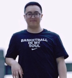

# Community Leaders

DJL is a community project. It is led by AWS and the many other contributors from a variety of backgrounds, both corporate and academic, who bring their unique perspectives to help make DJL and the Java deep learning ecosystem the best it can be. To recognize the great people helping us build this community, we created the **DJL Community Leaders** to help steer the project.

The community leaders are those who are the most active members of our community. They help give back to it by sharing projects, writing blog posts, giving talks, answering questions, contributing ideas, reviewing pull requests, and writing code in DJL. Like the project itself, the community leaders are a growing group and we are always looking to invite more people who show passion, dedication, and commitment to join.

| | | | | |
|-------|----------------|---------|------------| ----------- |
|   Anthony |   Aziz |   Christoph |   Erik |   Frank
|   fuyingzhi |   Jake |   Keerthan |   Kimi |   Lai
|   Lu |   Marat |   Marcos |   Qing |   Stanislav
|   Wei |   Zach

#### Anthony Feenster

Anthony is an intern with the AWS Deep Learning team. He is a junior studying Computer Science at Morgan State University. He is currently building a model download and uploader which is simple and easy to use. In his time off, he enjoys playing games, running, and exercising.

#### Christoph Henkelmann

[github](https://github.com/chenkelmann) [twitter](https://twitter.com/chenkelmann)

Christoph is a developer, speaker and entrepreneur who lives in Cologne, Germany. He has co-founded [TheAppGuys](https://theappguys.de), a mobile and server solutions provider and [DIVISIO](https://divis.io), a specialist for enterprise-ready Deep Learning applications, where he currently has the role of CTO. At DIVISIO, he combines practical knowledge from two decades of server and mobile development with proven AI and ML technology. This has caused him to appreciate the benefits of DJL, which has the feature-richness and flexibility to implement brand new papers while at the same time allowing the development of production ready software thanks to its strong industry focus. Christoph also holds a degree in Computer Science from the University of Bonn which comes in handy when the math in a paper becomes scary. In his pastime he grows cacti, practices the piano, and plays video games.

#### Erik Bamberg

[github](https://github.com/ebamberg) [twitter](https://twitter.com/ErikBamberg) [email](mailto:erik.bamberg@web.de)

Erik Bamberg works as a Senior Developer at J.P.Morgan where he councils java developers, mentors junior team members, and develops software for the financial sector.
During his 25 years of experience as a Java evangelist, he found his passion in Java coaching and consulting. Working for a Java expert company as a coach and consultant he could share his experience as an expert for Java performance, database persistence, and Spring by writing blogs and articles.
Starting his career in the healthcare sector for hospital information systems and designing a telemedicine platform, he also had the chance to work in many sectors like logistics, industrial automation, or chemical industries and latest in the financial sector.
He also enjoys being creative in his band Kiss Shot and philosophizes about movies.

#### Frank Liu

[github](https://github.com/frankfliu)

Frank Liu is a Software Engineer for AWS Deep Learning. He focuses on building innovative deep learning tools for software engineers and scientists. In his spare time, he enjoys hiking with friends and family.

#### Jake Lee

[github](https://github.com/stu1130)

Jake is one of core developers in the AWS DJL team. He graduated from CMU with MS degree in Software Engineering. He loves to learn things about Deep Learning in particular Deep Learning System. Outside of work, Jake enjoys watching movie, TV series, and anime.

#### Keerthan Vasist

[github](https://github.com/keerthanvasist)

Keerthan is a software engineer in AWS Deep Engines Org. His current work focuses on explainability and bias in machine learning. Outside of work, he enjoys playing Ultimate Frisbee, and badminton.

#### Kimi Ma

[github](https://github.com/kimim)

Kimi Ma is Industrial Internet director of Wanxiang Group, responsible for Wanxiang industrial digital platform development, business model innovation, and global partnerships. His primary interests in 2021 include energy internet, distributed intelligence and smart city. Before joining Wanxiang, Kimi was the R&D Manager of ABB control technology platform and Nokia Siemens Network.
Meantime, he is a board member in the Alliance of Industrial Internet and contributes to Clojure DJL: [clj-djl](https://github.com/kimim/clj-djl).

#### Lai Wei

[github](https://github.com/roywei)

Lai Wei is a Software Engineer with the AWS Deep Learning team. He is focusing on building easy to use, high-performance and scalable deep learning frameworks for engineers and data scientists. Outside of work, he enjoys spending time with his son, hiking, and skiing.

#### Lu Huang

Lu is the PM for DJL. She’s passionate about evangelizing and breaking the barriers for AI adoptions. Before becoming a product manager, she was a data scientist for several years.

#### Marat Gubaidullin

[github](https://github.com/mgubaidullin) [twitter](https://twitter.com/mgubaidullin)

Marat is a Senior Solutions Architect at Red Hat. A curious technology evangelist and passionate about open source, he is a fierce promoter of Quarkus, Apache Camel contributor, and DJL enthusiast. Marat contributed to the [DJL Apache Camel integration](https://camel.apache.org/components/latest/djl-component.html).

#### Marcos Nieves

[github](https://github.com/markbookk)

Marcos is an intern in the DJL team. He is a senior at the University of Puerto Rico studying Software Engineering. His current focus is Machine Learning, Deep Learning, and Cloud Computing. In his spare time, he likes to kayak and to find ways to save time by using automation.

#### Qing Lan

[github](https://github.com/lanking520)

Qing is a Software Developer Engineer in AWS. He is one of the DJL core developers and PPMC member of Apache MXNet. He graduated from Columbia University in 2017 with a MS degree in Computer Engineering. He is focusing on the distributed Deep Learning training and inference area.

#### Stanislav Kirdey

[github](https://github.com/skirdey)

Stanislav works at Netflix where he focuses on large scale applied machine learning in the areas of NLP, search, and anomaly detection. Outside of Machine Learning and work, Stanislav is obsessed with RuPaul's Drag Race, POSE and Star Trek.

#### Wei Zhao

[github](https://github.com/Jzow)

Wei is a Java full stack Development Engineer in Shanghai international human phenotype Group Research Institute (Fudan University). He has completed a number of full-time technical development of small and medium-sized projects (laiyifen BPM, Fudan University HPC billing, China Eastern Airlines database maintenance). He is passionate about using programming technology to solve some practical problems in life.

#### Zach Kimberg

[github](https://github.com/zachgk) [twitter](https://twitter.com/zachkimberg)

Zach is one of the core developers at DJL. He is a committer on the Apache MXNet deep learning framework who worked on the Java/Scala frontend before joining DJL to create a framework that is designed for Java first. He focuses on training and making a deep learning system that is as easy to use as possible. Outside of DJL, he is interested in the design of programming languages, decentralized systems, and general AI.

#### Yingzhi Fu

[github](https://github.com/fuyz)

Fu is a PC and Mobile web developer from China and working in Ascend International Education Group. He is living and working in Shenzhen. Outside of work, he enjoys playing basketball, swimming and bodybuilding.

#### Aziz Zayed

[github](https://github.com/AzizZayed) [linkedin](https://linkedin.com/in/aziz-zayed-cs)

Aziz is an intern in the DJL team. He is a sophomore at McGill University studying Software Engineering. Other than making software projects on his free time, he plays Basketball and enjoys Boxing. His main interests lie in the applications of Deep Learning in the medical field.
